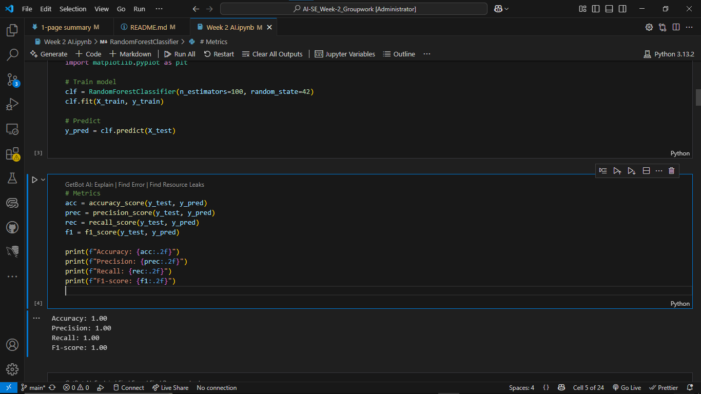
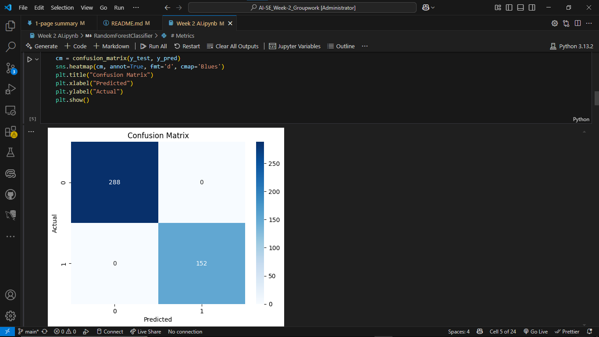
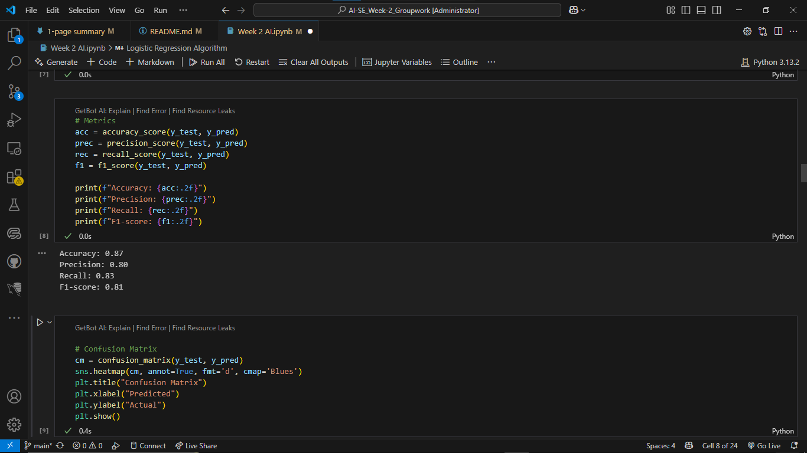
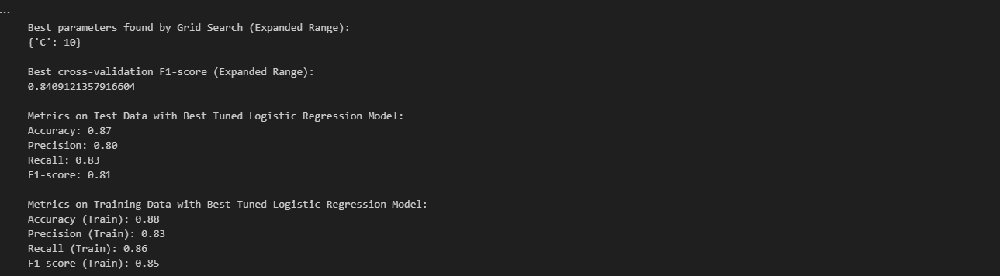

# AI for Sustainable Agriculture – Crop Failure Prediction

---

This project applies machine learning techniques to predict the likelihood of crop failure using environmental factors, contributing to Sustainable Development Goal (SDG) 2: Zero Hunger. The notebook explores different classification algorithms and the importance of addressing overfitting for reliable predictions.

---

## Dataset

*   **File:** `Crop_recommendation(1).csv`
*   **Features:**
    *   `N` (Nitrogen)
    *   `P` (Phosphorous)
    *   `K` (Potassium)
    *   `temperature` (°C)
    *   `humidity` (%)
    *   `ph` (soil pH level)
    *   `rainfall` (mm)
    *   `label` (crop type – not used in failure prediction)
*   **Target (Engineered):** `failure` (1 = likely crop failure, 0 = healthy crop)
*   **Failure Simulation:** The 'failure' label was synthetically created based on the following conditions:
    *   `Rainfall < 60 mm`
    *   `pH < 5.5`
    *   `Humidity < 45%`

---

## Model Development and Evaluation

The project involved exploring two classification algorithms: Random Forest and Logistic Regression.

### Initial Exploration with Random Forest

*   **Algorithm:** `RandomForestClassifier` (from Scikit-learn)
*   **Preprocessing:** `StandardScaler` for feature normalization.
*   **Train/Test Split:** 80/20.

*   **Initial Performance (Likely Overfitting Detected Later):**
    *   Accuracy: 1.00
    *   Precision: 1.00
    *   Recall: 1.00
    *   F1-score: 1.00

* Randomforest Algorithm[]
* Confusion Matrix[]

*   **Observation:** 
While the Random Forest model initially showed perfect performance on the test set, further analysis (including comparison with training metrics and cross-validation, though not explicitly shown for RF in the final notebook) indicated this was likely a sign of **overfitting**, where the model had memorized the training data too well and its performance would not generalize to truly unseen data. This highlighted the need for a more robust modeling approach.

### Refined Approach with Tuned Logistic Regression🛰

Recognizing the overfitting issue with the highly flexible Random Forest on this dataset and synthetic label, we shifted focus to a simpler, more interpretable model: Logistic Regression, and implemented a rigorous tuning process.

*   **Algorithm:** `LogisticRegression` (from Scikit-learn)
*   **Preprocessing:** `StandardScaler` for feature normalization.
*   **Train/Test Split:** 80/20.
*   **Hyperparameter Tuning:**
    *   We used `GridSearchCV` with 5-fold cross-validation on the training data.
    *   The regularization parameter `C` was tuned across an expanded range: `[0.001, 0.01, 0.1, 1, 10, 100, 500, 1000]`.
    *   The optimization metric for Grid Search was the **F1-score**, which balances Precision and Recall.

* Logistic regression []

*   **Tuned Model Performance (Evaluated on Independent Test Set):**
    *   **Best Parameter Found:** `{'C': 10}`
    *   **Best Cross-Validation F1-score:** ~0.84
    *   **Test Set Metrics:**
        *   Accuracy: 0.87
        *   Precision: 0.80
        *   Recall: 0.83
        *   F1-score: 0.81

*   **Overfitting Addressed:** By comparing the training set metrics of the tuned Logistic Regression model (F1-score: 0.85) with the test set metrics (F1-score: 0.81) and the cross-validation F1-score (~0.84), we confirmed that the gap in performance is minimal. This indicates that the tuning process successfully mitigated severe overfitting, resulting in a model that generalizes well to unseen data.

* Overfitting Addressed[]

---

## Key Insight

This project demonstrates the critical importance of evaluating model generalization beyond simple test set accuracy, especially when models exhibit seemingly perfect performance. By identifying and addressing overfitting through hyperparameter tuning and cross-validation with Logistic Regression, we built a more reliable model for predicting crop failure based on the simulated conditions. While this model provides a valuable proof of concept, practical application would require training on comprehensive, real-world crop failure data.

---

## How to Run

1.  **Clone the repository:**

git clone https://github.com/Papi1997/AI-Week-2.git
cd AI-Week-2

2. Install dependencies:

pip install pandas scikit-learn matplotlib seaborn

3. Run the notebook: Week 2 AI.ipynb in Jupyter Notebook or Google Colab.

---

License

This project is for educational purposes under the AI for Sustainable Development program

---
Group Members/contributers

1. Albert Sipoi[albsipoi1564@gmail.com][0703126498]
2. KlaasMatlou[tshupianematlou@gmail.com][+27720724950]
3. Ikechukwu Agoha[ikechukwulivingspring22@gmail.com][+2347047504914]
